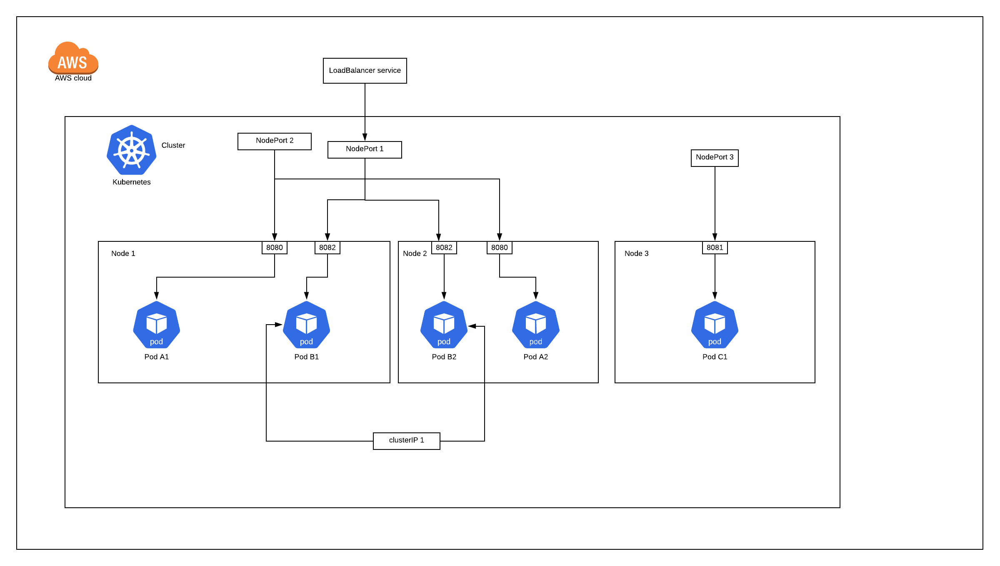

Frequently used glossary in kubernetes

**Cluster**: A set of worker machines, called nodes, that run containerized applications. Every cluster has at least one worker node

**Master/ Control Plane**: The container orchestration layer that exposes the API and interfaces to define, deploy, and manage the lifecycle of containers

**Node/ Worker node**: A node is a worker machine in Kubernetes

**Pod**: The smallest and simplest Kubernetes object. A Pod represents a set of running containers on your cluster

**Container**: A lightweight and portable executable image that contains software and all of its dependencies

**Deployment**: An API object that manages a replicated application

**kubectl**: A command-line tool for communicating with a Kubernetes API server

**Namespace**: An abstraction used by Kubernetes to support multiple virtual clusters on the same physical cluster

**ReplicaSet**: A ReplicaSet (aims to) maintain a set of replica Pods running at any given time

**Label**: Tags objects with identifying attributes that are meaningful and relevant to users

**Selector**: Allows users to filter a list of resources based on labels

**Service**: An abstract way to expose an application running on a set of Pods as a network service

**Volumes**: A directory containing data, accessible to the containers in a pod

**Kubernetes API**: The application that serves Kubernetes functionality through a RESTful interface and stores the state of the cluster

After cloning this repo https://bitbucket.org/corpinfo/k8s-demo4rbna 
1. ```cd k8s-demo4rbna/```

2. Follow these instructions from AWS in order to launch k8s cluster with worker nodes: https://docs.aws.amazon.com/eks/latest/userguide/getting-started-console.html#eks-create-cluster

3. or more easy way to launch a cluster
     * Have aws cli configured
     * Install eksctl https://github.com/weaveworks/eksctl and run the following command
          ```
          eksctl create cluster \
          --name prod \
          --version 1.14 \
          --region us-west-2 \
          --nodegroup-name standard-workers \
          --node-type t3.medium \
          --nodes 3 \
          --nodes-min 1 \
          --nodes-max 4 \
          --ssh-access \
          --ssh-public-key my-public-key.pub \
          --managed
          ```

3. Follow these instruction to be able to use the k8s dashboard: This is a good example for RBAC(Just like an IAM in AWS), kubectl proxy(Creates a proxy server or application-level gateway between localhost and the Kubernetes API Server)

https://docs.aws.amazon.com/eks/latest/userguide/dashboard-tutorial.html


4. Deploying an Nginx deployment: cat ```nginx-deployment.yaml|kubectl create -f ```

     * Watch the pod while depeploying ```kubectl get pod --watch```

     * To get the description of a pod: ```kubectl describe pod pod-name```

     * Exposing to a service: kubectl expose deployment ```nginx-deployment --port=80 --type LoadBalancer```

5. demo of a pod logs: ```kubectl create -f pod-log.yaml```

6. Jenkins: https://8gwifi.org/docs/kube-jenkins.jsp

     * Creating a persistent volume: ```Kubectl create -f jenkins-pv.yaml```

     * Creating a volume claim: ```kubectl create -f jenkins-pvc.yaml```

     * Launching all the resources for jenkins: ```helm install jenkins --set persistence.existingClaim=jenkins-pvc stable/jenkins```

     * uninstall jenkins: ```helm uninstall jenkins```

7. Deleting a pod ```kubectl delete pod [POD_NAME]```

8. Deleting any resource ```kubectl delete [RESOURCE_TYPE] [REDOURCE_NAME]```

9. Listing the namespaces kubectl get namespaces

This cheat sheet can help get more understanding when we play around with these Kubernetes API calls https://kubernetes.io/docs/reference/kubectl/cheatsheet/


# Services

services it's an abstract way of exposing a pod. It will let pods communicate with each other and load balance at the same time 

* ClusterIP = Internal
* Nodeport = External (very rarely used)
* LoadBalancer= External

if any pod is exposed with any of the service then any pod with in the cluster can communicate with the exposed pod

